---
jupytext:
  text_representation:
    extension: .md
    format_name: myst
    format_version: 0.13
    jupytext_version: 1.14.5
kernelspec:
  display_name: Python 3
  language: python
  name: python3
---

# Installation

Below explained are the steps necessary for Windows users to use Fortran in local PC.

1. Installation of compiler 
2. Setup of environmental variables
3. Installation of code editor (Visual Studio Code) and extentions
4. Setup of a build task in VS Code
5. Setup of custom user snippets in VS Code

## Installation of compiler 

First, you need to get a compiler called gfortran. The role of using the compiler is to convert a f90 file to an executable file. We can install gfortran very easily thanks to Quickstart Fortran (https://github.com/LKedward/quickstart-fortran). You can download an executable file from their release page: https://github.com/LKedward/quickstart-fortran/releases. Note that this tool is only compatible with Windows currently. You will see a warning message after you click an exe file, but please go ahead and trust this software.


## Set up of environmental variables
Next, you need to set the path variable so that you are able to use a command `gfortran`
in a terminal. Here is the procedure for this:
1. Type `env` in the Windows search window
2. Select `Edit the system environment vaiables` under Control panel
3. Select `Environment Vaiables...`
4. Now you can edit Path. Please be aware that you do not delete existing path variables and you just add a new path variable, which is `C:\Users\USERNAME\AppData\Local\quickstart_fortran\mingw64\bin`
Note that "USERNAME" must be replaced with a user name that is set in your PC.


## Installation of code editor (Visual Studio Code) and extentions

We need a code editor to write a code, editing a f90 file. With a bare minimum, you can use a notepad; however, it is hard to visually understand the structure of a code (because it is black-and-white) and/or to locate mistyped code. Here, a sophisticated code editor is coming to play. Visual Studio Code is one of them, which provides you with syntax highlighting, auto-detection of mistyping, user snippets for frequently-used code blocks and so on. In addition, it is integrated with a terminal so that you do not have to go back and forth between a code editor and a terminal. You can visit https://code.visualstudio.com/ to get the software. In Visual Studio Code, you can install a extension to facilitate your coding. Here is a specific extension dedicated to Fortran, `Modern Fortran` maintained by the Fortran Programming Language Organization, the same group that has developed Quickstart Fortran. You can tap the tile-shaped icon located in the left side bar, put ’Modern Fortran’ in the search window, and find that extension as seen below. 

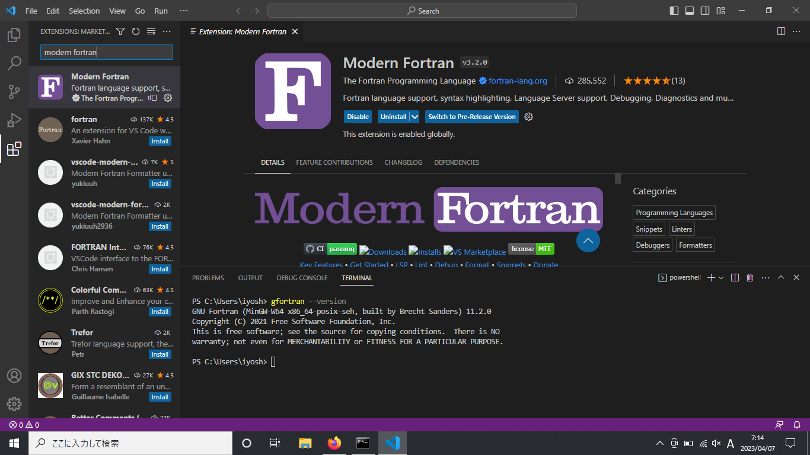

Please make sure that this extention is activated while you code to leverage functionality such as syntax highlighting.

Antother useful extention is called `Material Icon Theme`. With this extention activated, you will see an icon next to a file name so that the type of file can be easily identified.

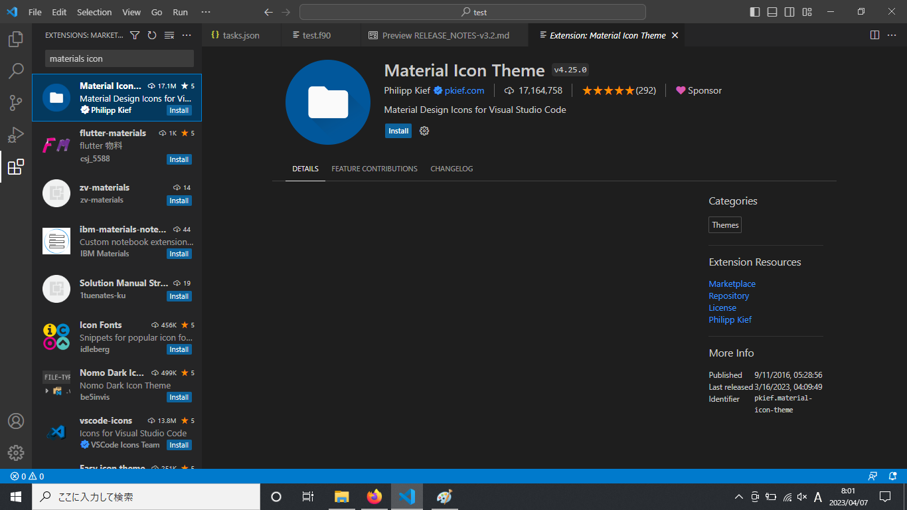

Now You are ready to check if the installed compiler works. You can open a terminal inside Visual Studio Code. 

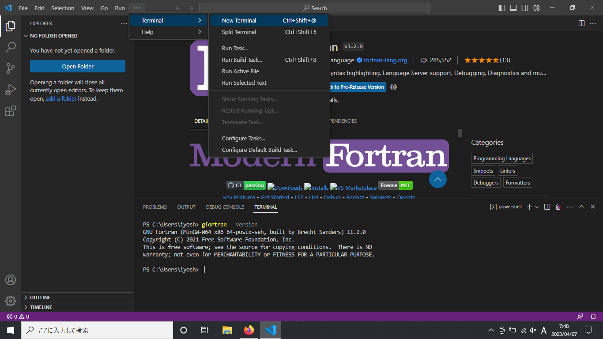

By typing `gfortran --version` in a terminal, if you get version information in the terminal, you have succeeded in the installation. 

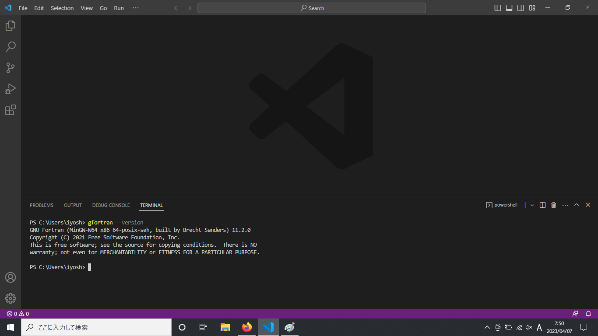

> If you see a message saying “gfortran is not recognized”, please close VS code or kill the teminal. Then, please reopen VS code and/or open new terminal.

Let’s create a very first f90 file and look at the procedure:
1. Create a new folder called test in Desktop (this is an example; you can choose a location wherever you want) to store f90 files.

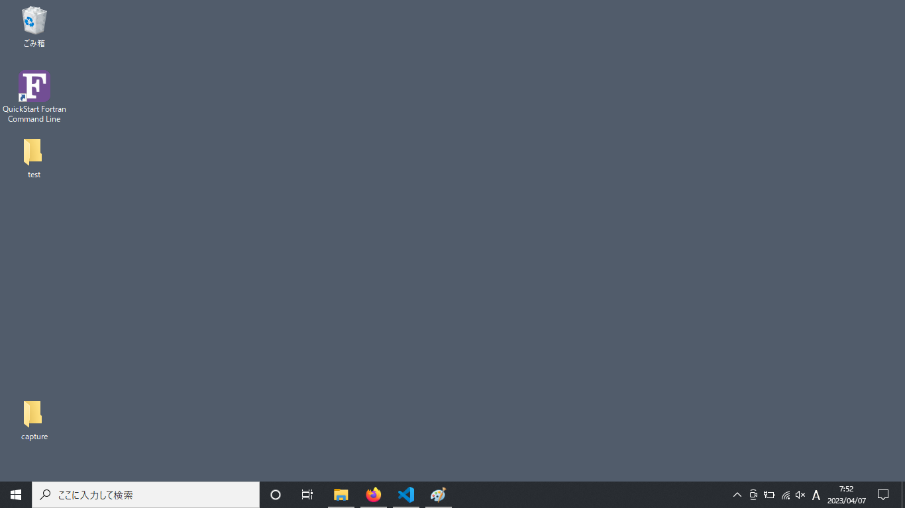

2. Open Visual Studio Code and open the folder just created.

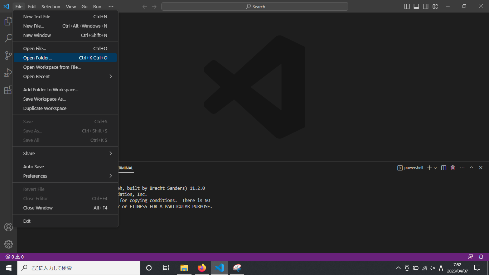

3. Create a new f90 file
4. Write a code (here we assume that a file name is `test.f90`)
```fortran
program name
  implicit none
  print*, 'test'

end program
```
5. Run the code in the terminal: `gfortran test.f90 -o test`
6. Run the execution file (a.exe) that is created in the Step 5 in the terminal: `./test`

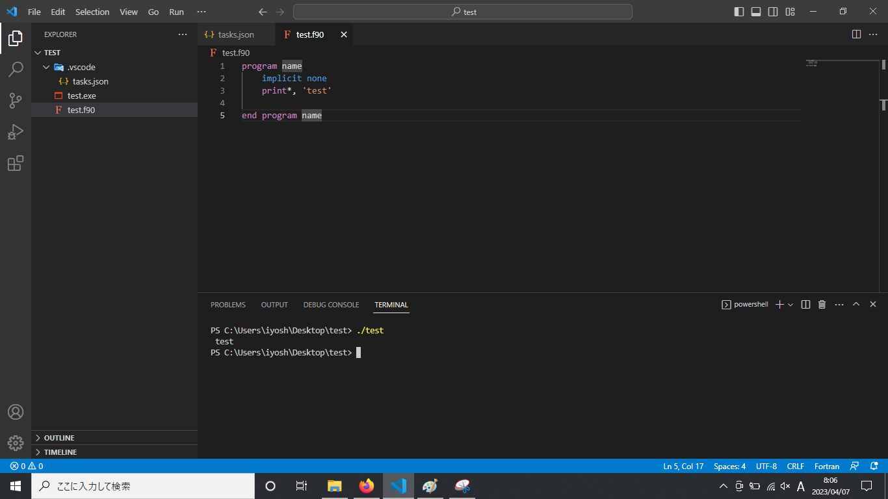

## Setup of a build task in VS Code
There is another way to produce an executable file (.exe file). You can open `Terminal > Run Build Task`. A preliminary set-up is necessary to use this functionality.

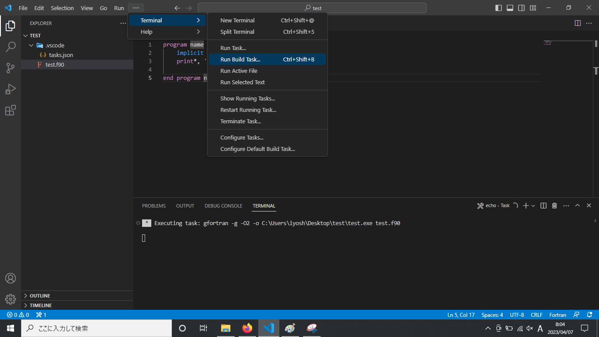

You will first select `No build task to run found. Configure Build Task…`. 


After that, select `Create tasks.json from template`. 


Then select 'Others' so that a file named ‘tasks.json’ will be created under the folder, ‘.vscode’. 

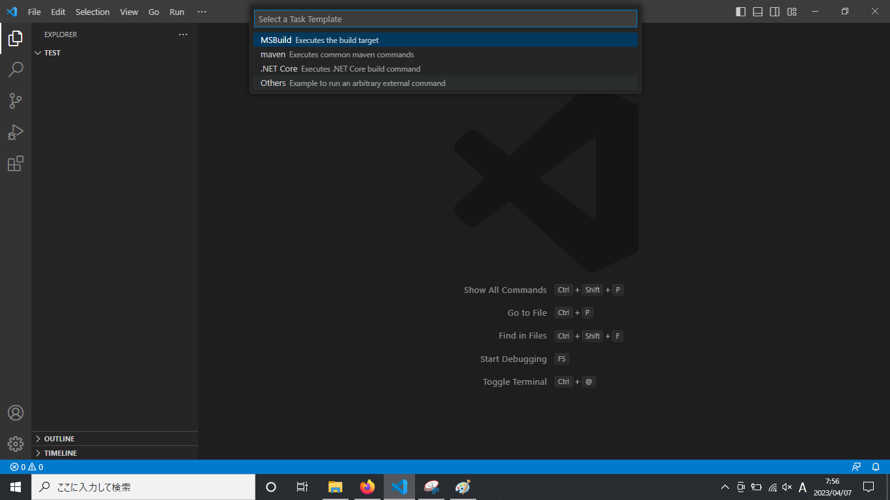

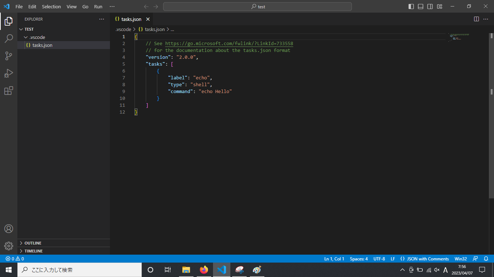

You can place a provided `tasks.json` file ([Download](./tasks.json)) under the `.vscode` folder to overwrite the default file. In the “args” section, you will see command options attached:
- `-g` : produce debugging
- `-O2`: set optimization level as 2
- `-o`: produce the executable file with a given name

Now you can select again `Terminal > Run Build Task` (or press `Ctrl+Shift+B` as a shortcut key). An execution file with a give name will be created (here, “test.exe” will be created). 

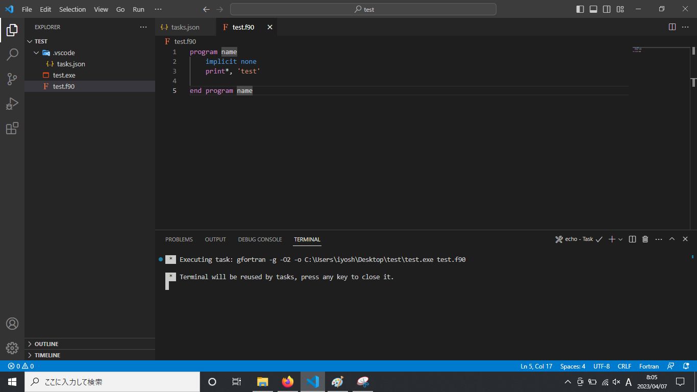

## Setup of custom user snippets in VS Code
It is annoying to type the first line (i.e., `use,intrinsic :: iso_fortarn_env`) every time you create a new file. A solution to save time is using user snippets. You can type “fun” and then you will see a candidate snippet displayed. By choosing it, you can retrieve a block of code. This is an example of user snippets provided by the extension, ModernFortran. To set our own user snippets, first open `File - Preferences - User Snippets` in Visual Studio Code. You are prompted to select a snippets file. `FortranFreeForm.json(Fortran90)` is the one we want to choose. 

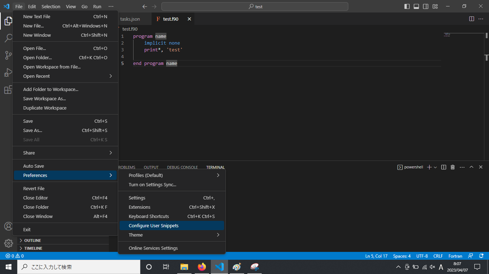

Inside this file, there are a bunch of guide comments in default, showing you how to write user snippets. 

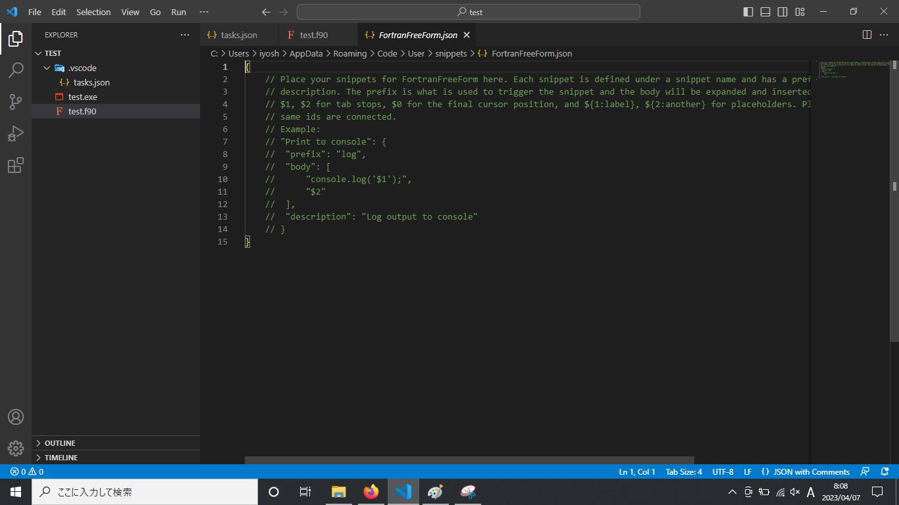

You can delete the entire comments and put the following code:

```json
"Using iso fortran env module": {
  "prefix": "usf",
  "body": [
           "use,intrinsic :: iso fortran env"
          ],
  "description": "Using iso fortran env module"
}
```
Other snippets looks like:

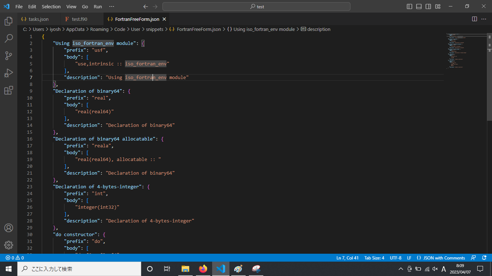

You can download `FortranFreeForm.json` ([Download](./FortranFreeForm.json)) and replace the existing code with the downloaded file.

Now you just type `usf` and Visual Studio Code automatically provides you with the one line of code, `use,intrinsic :: iso_fortran_env`.

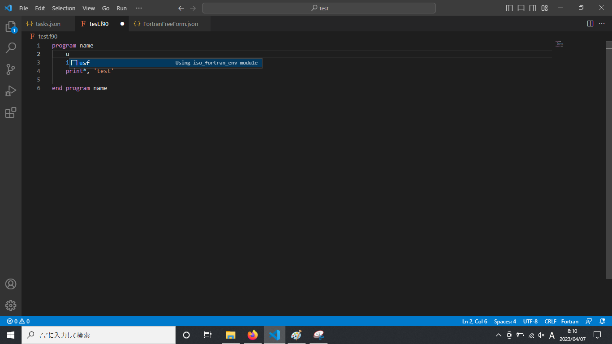

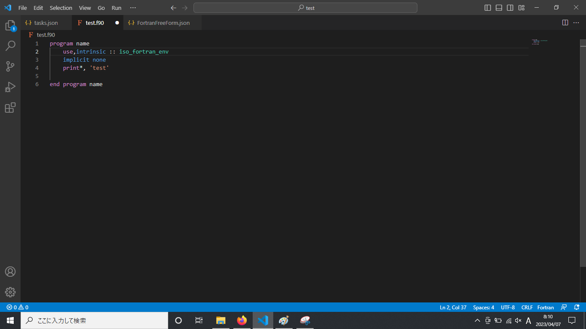

## Shortcut keys
There are useful shortcut keys to speed up your coding in Visual Studio Code. Although you might feel uncomfortable to use them initially, but once you get used to them, there is no doubt that your coding is much faster.

- Toggle line comment : press Ctrl + /
- Add selection to next Find match:
- Drag a word/part of interest and press Ctrl + d
- Copy line up/down: press Shift + Alt + ↑ or ↓
- Move line up/down: press Alt + ↑ or ↓
- Delete a line: press Ctrl + Shift + k

## Visualization software

Among a plenty of options for visualization software, we will use a Python library called matplotlib. To use Python, an easy way is to use Miniconda. You can get an executable file at the following site: https://docs.conda.io/en/latest/miniconda.html#windows-installers

Once you install Miniconda in your local PC, next create a new folder (e.g., "fortran-programs" at Desktop), where a where a notebook and Fortran programs are also placed. You can put a file named `environment.yml` ([Download](./environment.yml)) in the new folder, and then run the following commands at Anaconda command prompt (the first command is for moving to the folder):

```bash
cd Desktop/fortran-programs
conda env create -f environmnet.yml
```

In the yaml file, `environment.yml`, the name of environment as well as libraries to be installed are described.

```yaml
name: fortran-excercises
channels:
  - conda-forge
dependencies:
  - python=3.10
  - ipython
  - jupyter
  - jupyterlab>3
  - numpy
  - pandas
  - matplotlib
```

The deault environment called "base" is already there, but we do not use this environment. Instead, we will create a new environment and then install necessary python libraries so that if something wrong happens, we can simply delete this environment and start from the scratch. However, if we mess up with the base environment, we may need to re-install Miniconda, which would waste time. To activate a new environment of which the name is "fortran-programs", execute the following command:

```bash
conda activate fortran-programs
```

Then, you can type the following command and you will see a web browser automatically launch.

```bash
jupyter lab
```

The above is the settings you need to do for the first time. From the second time, you just run commands in three steps.

1. Open the Anaconda terminal and move to the working folder

```bash
cd Desktop/fortran-programs
```

2. Activate the environment, “fortran-programs”

```bash
conda activate fortran-programs
```

3. Launch Jupyter Lab

```bash
jupyter lab
```


